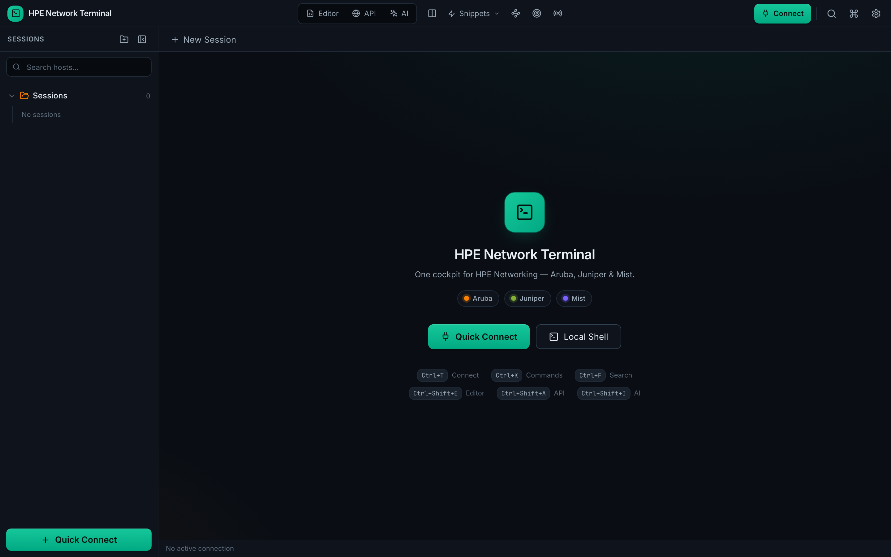

# GreenCLI

One cockpit for **Aruba · Juniper · Mist**. A modern, cross-platform terminal, SSH client, config editor, REST API explorer, and AI assistant built as a SecureCRT/Termius replacement, with multi-vendor syntax highlighting for network engineers.

> 📘 **New here? See the [Setup & Configuration Guide](docs/SETUP.md)** — installing,
> running, and configuring every feature (SSH/vault, AI providers, MCP, Aruba Central,
> on-prem REST, network intent, TLS, screenshots).



## Features

- **SSH, Telnet, Serial & Local PTY** connections (with jump-host / ProxyJump)
- **Aruba** AOS-CX / AOS-S / InstantOS / ArubaOS syntax highlighting
- **Juniper Junos** (EX/QFX/SRX/MX) syntax highlighting
- **Juniper Mist** cloud awareness (API Explorer integration)
- **Auto device detection** - identifies vendor/OS from the prompt
- **Tabbed sessions**
- **Session manager** with folders and organization
- **Encrypted credential vault** (AES-256-GCM + Argon2)
- **Real-time syntax highlighting** with ANSI color injection
- **Modern dark/light themes**
- **Keyboard shortcuts** (Ctrl+T connect, Ctrl+W close, Ctrl+F search, Ctrl+, settings)
- **Fast terminal rendering** via xterm.js

## Tech Stack

| Layer | Technology |
|-------|------------|
| Frontend | React 18 + TypeScript + Tailwind CSS |
| Terminal | xterm.js 5.x |
| Shell | Tauri 1.6 (Rust + WebView) |
| SSH | russh (Rust native SSH library) |
| Telnet | tokio async TCP |
| Serial | tokio-serial |
| Crypto | AES-256-GCM + Argon2 |

## Project Structure

```
green-cli/
├── src/                          # React frontend
│   ├── App.tsx                   # Root component / view routing
│   ├── PopOutTerminal.tsx        # Pop-out terminal window entry
│   ├── main.tsx                  # React entry point
│   ├── components/               # UI components
│   │   ├── Terminal.tsx          # xterm.js wrapper
│   │   ├── TerminalTabs.tsx      # Tab bar
│   │   ├── Sidebar.tsx           # Session tree
│   │   ├── StatusBar.tsx         # Connection status
│   │   ├── QuickConnect.tsx      # Quick connect dialog
│   │   ├── SshAuthDialog.tsx     # SSH authentication
│   │   ├── SettingsPanel.tsx     # Settings UI
│   │   ├── SearchOverlay.tsx     # Terminal search
│   │   ├── AiAssistant.tsx       # AI assistant panel
│   │   ├── ApiExplorer.tsx       # REST API explorer (Central / device / Mist)
│   │   ├── BulkRunner.tsx        # Run one command across sessions
│   │   ├── ConfigEditor.tsx      # Monaco config editor
│   │   ├── HelpPanel.tsx         # In-app help (F1)
│   │   ├── IntentPanel.tsx       # Network intent / desired state
│   │   ├── McpServers.tsx        # MCP server manager
│   │   ├── SftpBrowser.tsx       # SFTP file browser
│   │   ├── TunnelsManager.tsx    # SSH local/dynamic forwards
│   │   └── …                     # Command palette, vault, triggers, dialogs, toaster
│   ├── syntax/                   # Syntax highlighting engine
│   │   ├── highlighter.ts        # Core highlighting engine
│   │   ├── grammar-aruba-cx.ts   # Aruba CX grammar (100 commands, 120 subcommands)
│   │   ├── grammar-aruba-ap.ts   # Aruba AP grammar (56 commands, 88 subcommands)
│   │   ├── grammar-aruba-ctrl.ts # Aruba Controller grammar (76 commands, 80 subcommands)
│   │   ├── grammar-junos.ts      # Juniper Junos grammar
│   │   └── ansi-processor.ts     # ANSI sequence processor
│   ├── data/                     # Static content (help topics, intent packs)
│   ├── hooks/                    # React hooks
│   ├── store/                    # Zustand state stores
│   ├── types/                    # TypeScript types
│   ├── styles/                   # Global CSS
│   └── utils/                    # Shared helpers (clipboard, backup, vault, intent, terminal)
├── e2e/                          # Playwright end-to-end tests (npm run test:e2e)
├── scripts/                      # Utility scripts (screenshot capture)
├── src-tauri/                    # Rust backend
│   ├── Cargo.toml                # Rust dependencies
│   ├── tauri.conf.json           # Tauri configuration
│   └── src/
│       ├── main.rs               # Tauri commands
│       ├── ssh/                  # SSH client (russh)
│       ├── telnet/               # Telnet client
│       ├── serial/               # Serial port client
│       ├── sftp/                 # SFTP file transfer
│       ├── vault/                # Credential vault (AES-256-GCM)
│       ├── session/              # Session manager
│       ├── ai/                   # AI provider backends
│       ├── api/                  # On-box REST (AOS-CX/AOS-8/AOS-S)
│       ├── central/              # Aruba Central client
│       ├── intent/               # Network intent engine
│       ├── local/                # Local PTY
│       └── mcp/                  # MCP client (stdio + streamable HTTP)
├── package.json                  # Node dependencies
└── playwright.config.ts          # Playwright configuration
```

## Quick Start

### Prerequisites

- [Node.js](https://nodejs.org/) 18+ and npm
- [Rust](https://rustup.rs/) toolchain
- OS-specific build tools for Tauri: [Tauri Prerequisites](https://tauri.app/v1/guides/getting-started/prerequisites)

### Install Dependencies

```bash
# Install Node dependencies
npm install

# Install Tauri CLI (if not already installed)
npm install -g @tauri-apps/cli
```

### Development Mode

```bash
# Start the dev server (Vite + Tauri)
npm run tauri-dev
```

### Build for Production

```bash
# Build the application
npm run tauri-build
```

The built application will be in `src-tauri/target/release/`.

### Cross-Platform Builds

```bash
# macOS (Universal binary)
npm run tauri-build -- --target universal-apple-darwin

# Windows (from Linux/macOS with cross-compilation)
npm run tauri-build -- --target x86_64-pc-windows-msvc

# Linux
npm run tauri-build -- --target x86_64-unknown-linux-gnu
```

## Keyboard Shortcuts

| Shortcut | Action |
|----------|--------|
| `Ctrl+T` | Quick Connect |
| `Ctrl+W` | Close Active Tab |
| `Ctrl+F` | Search Terminal |
| `Ctrl+,` | Open Settings |
| `F1` | Help & documentation (in-app) |
| `Ctrl+B` | Toggle Sidebar |
| `Ctrl+K` | Command Palette |
| `Ctrl+1`–`Ctrl+9` | Jump to tab N |
| `Ctrl+Tab` | Cycle to next tab |
| `Ctrl+Shift+A` | Toggle API Explorer |
| `Ctrl+Shift+I` | Toggle AI Assistant |
| `Ctrl+Shift+E` | Toggle Config Editor |
| `Ctrl+=` / `Ctrl+-` | Zoom terminal font in / out |
| `Ctrl+0` | Reset terminal font size |

(On macOS use `Cmd` instead of `Ctrl`.)

## Aruba Syntax Highlighting

The syntax highlighter supports **232 commands**, **288 subcommands**, and **144 keywords** across all three Aruba device types. It features:

- **Prompt detection** - Identifies device type from CLI prompt patterns
- **Auto-detection** - Scans terminal buffer to automatically identify connected device type
- **256-color ANSI** - Injects color codes for vibrant terminal display
- **Longest-match-first** - Correctly handles multi-word commands like `no shutdown`
- **Value highlighting** - Colors IP addresses, MAC addresses, VLAN IDs, and interface names

### Supported Device Types

| Device | Grammar Coverage |
|--------|-----------------|
| Aruba CX Switch | 100 commands, 120 subcommands, 59 keywords |
| Aruba Wireless AP | 56 commands, 88 subcommands, 44 keywords |
| Aruba Mobility Controller | 76 commands, 80 subcommands, 41 keywords |

## Security Features

- **AES-256-GCM encryption** for stored credentials
- **Argon2id** password hashing for master password
- Password-protected credential vault

## License

MIT
