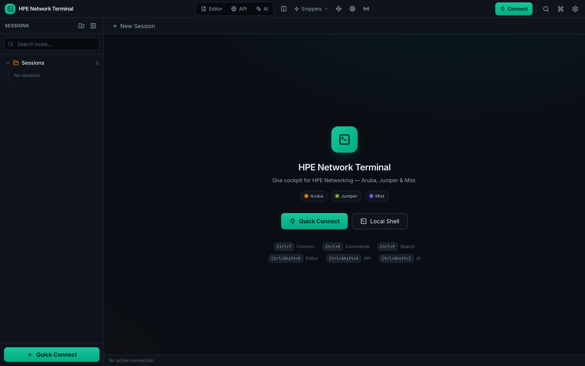
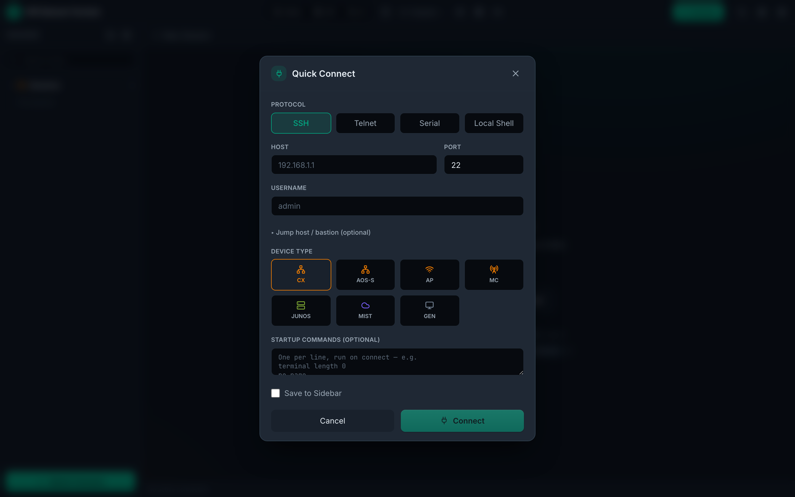
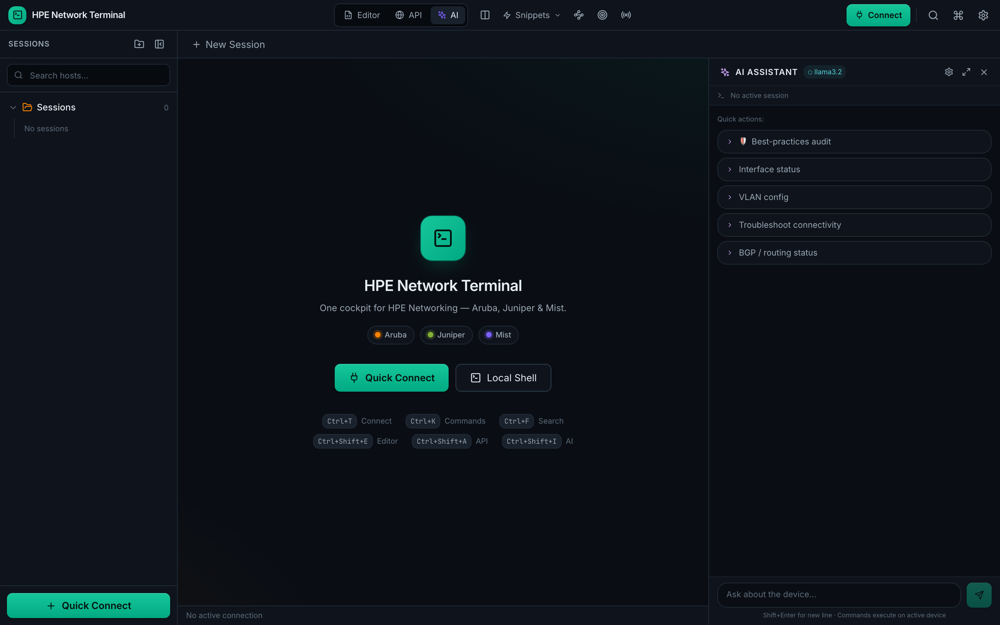
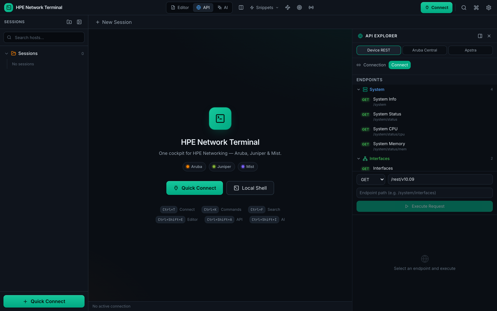
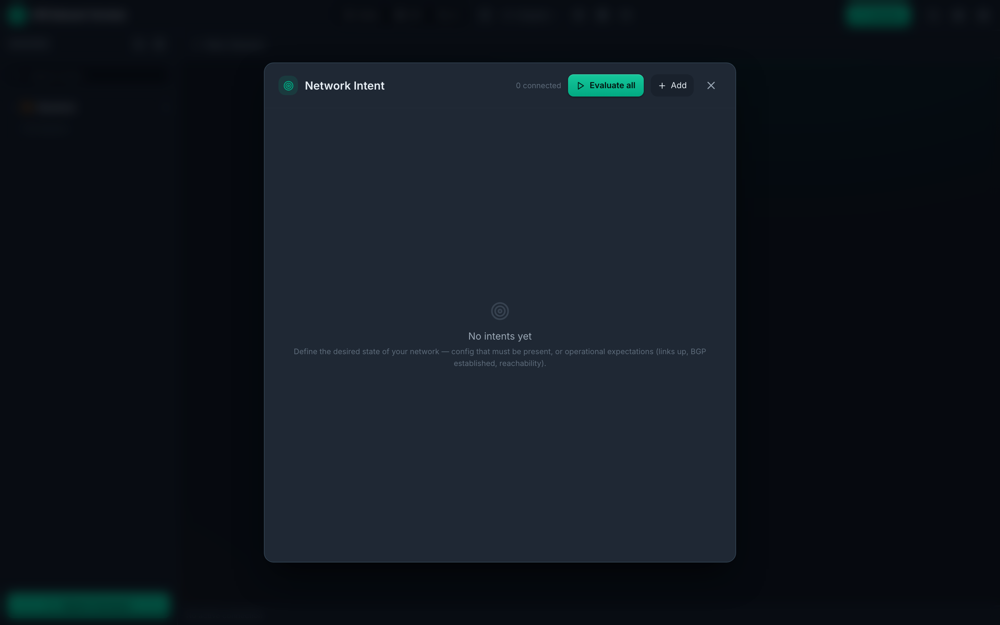
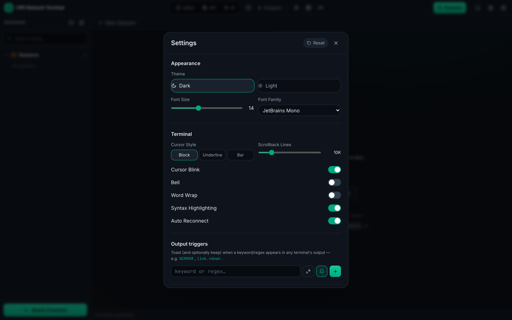
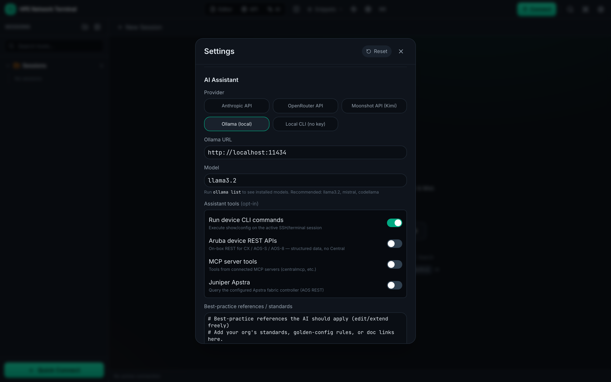
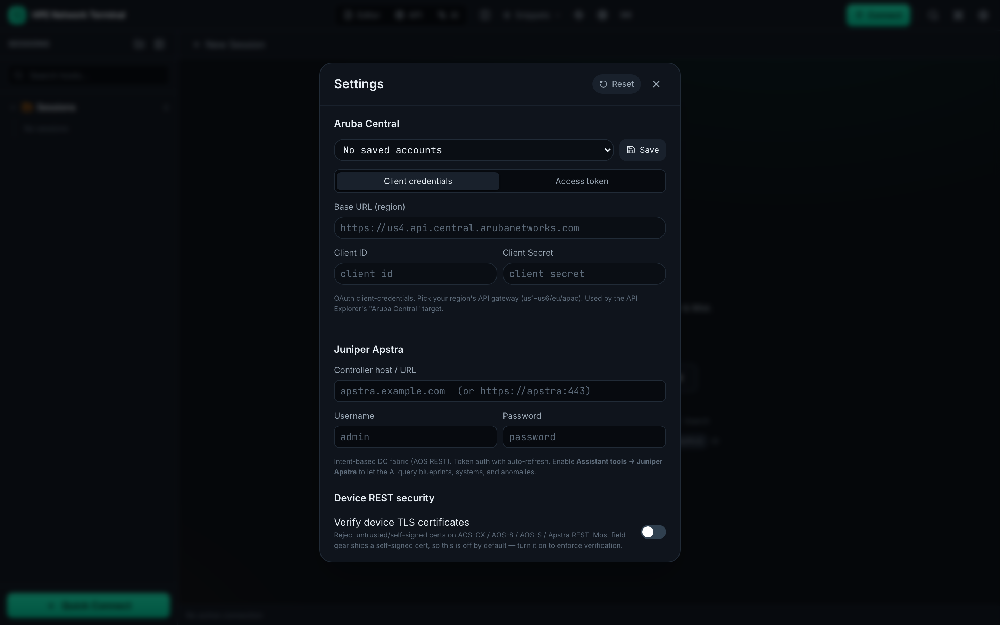
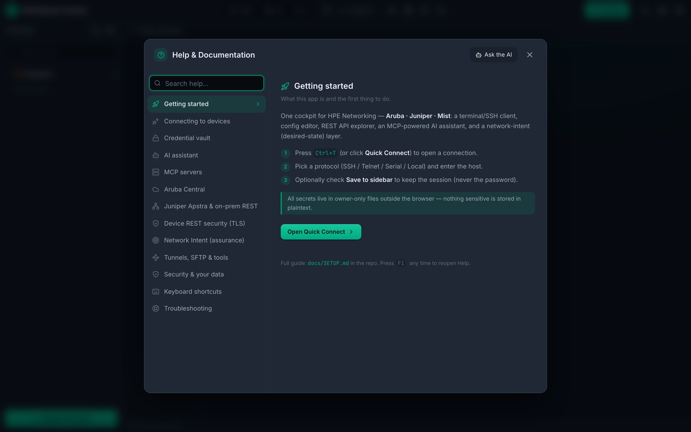

# GreenCLI — Setup & Configuration Guide

One cockpit for **Aruba · Juniper · Mist**: a terminal / SSH client,
config editor, REST API explorer, MCP-powered AI assistant, and a network-intent
(desired-state) layer.

This guide covers installing, running, and configuring **every** feature. For a
feature overview see the top-level [`README.md`](../README.md); for the work log see
[`ROADMAP.md`](../ROADMAP.md).

> 💡 **In-app help:** the same documentation is built into the app — press **`F1`**
> (or the **?** in the title bar, or `Ctrl+K` → "Help") to open a searchable Help panel
> with per-topic quick actions and an "Ask the AI" button.

---

## 1. Prerequisites

| Need | Why |
|------|-----|
| [Node.js](https://nodejs.org/) 18+ and npm | Build the React/TypeScript frontend |
| [Rust](https://rustup.rs/) (stable toolchain) | Build the Tauri/Rust backend |
| Tauri OS build tools | Native webview + bundling — see [Tauri prerequisites](https://tauri.app/v1/guides/getting-started/prerequisites) |

**Per-OS Tauri deps (summary — follow the link above for specifics):**
- **macOS**: Xcode Command Line Tools (`xcode-select --install`).
- **Windows**: Microsoft C++ Build Tools + the WebView2 runtime.
- **Linux**: `webkit2gtk`, `libssl`, `librsvg2`, `patchelf`, plus the usual build-essential set.

---

## 2. Install & run

```bash
# from the project root
npm install                 # install frontend deps (also pulls the Tauri CLI as a devDep)
```

### Run the full desktop app (recommended)

```bash
npm run tauri-dev           # builds the Rust backend + serves the UI in a native window
```

The first `tauri-dev` compiles the Rust crate, so it takes a few minutes; subsequent
runs are fast.

### Frontend-only (UI work, no native backend)

```bash
npm run dev                 # Vite dev server on http://localhost:1420
```

In a plain browser the UI renders but anything that calls the Rust backend
(connecting, the vault, AI egress, REST) is inert — use `tauri-dev` to exercise those.

### Production build

```bash
npm run build               # type-check + bundle the frontend (tsc && vite build)
npm run lint                # run ESLint on the frontend code
npx vitest run              # run frontend unit tests
npm run tauri-build         # produce the native installer/app in src-tauri/target/release/
```

Cross-target builds:

```bash
npm run tauri-build -- --target universal-apple-darwin     # macOS universal
npm run tauri-build -- --target x86_64-pc-windows-msvc     # Windows
npm run tauri-build -- --target x86_64-unknown-linux-gnu   # Linux
```

---

## 3. Where your data lives

All state is stored **outside the webview**, in the OS app-data directory for bundle
id `com.greencli.app`:

| OS | Path |
|----|------|
| macOS | `~/Library/Application Support/com.greencli.app/` |
| Linux | `~/.local/share/com.greencli.app/` |
| Windows | `%APPDATA%\com.greencli.app\` |

| File | Contents | Notes |
|------|----------|-------|
| `sessions.json` | Saved sessions + folders | **No secrets** — passwords/keys are never written here |
| `vault.enc` | Encrypted credential vault | AES-256-GCM; written `0600`, atomic |
| `ai_keys.json` | AI provider API keys | `0600` |
| `mcp_servers.json` | MCP server definitions | — |
| `mcp_creds.json` + `mcp_creds/` | MCP server credentials | `0600` |
| `known_hosts.json` | TOFU SSH host-key fingerprints | atomic writes |
| `intents.json` | Network-intent definitions + last result | atomic; corrupt file is preserved, never silently wiped |

> Secrets are deliberately kept out of browser `localStorage`. Aruba Central / Apstra
> credentials entered in Settings are stored **encrypted in the credential vault**
> (`vault.enc`) when it is unlocked, so they survive a restart; while the vault is
> locked they live in memory for the session only (same model as saved SSH
> passwords). Account metadata (name / URL / client-id) persists either way.

---

## 4. Connecting to devices

Open **Quick Connect** (`Ctrl+T`) or double-click a saved host in the sidebar.

- **Protocols**: SSH, Telnet, Serial, and Local (a local shell / CLI).
- **SSH auth**: password, private key (Browse… to load a key file), or **ssh-agent**
  (uses `SSH_AUTH_SOCK` / the OS agent). If `password` auth is refused, it falls back
  to **keyboard-interactive** (TACACS+/RADIUS) — the password answers only the first
  prompt, so a second-factor/OTP prompt is left for you.
- **Jump host / ProxyJump**: set a bastion host/port/user; it authenticates with the
  jump password if given, else your key, else the agent.
- **Serial**: port, baud, and data/parity/stop bits.
- **Startup commands**: per-host commands run automatically once the shell is ready
  (e.g. `terminal length 0`, `no page`).
- **Save to sidebar** persists the session (including jump-host and local
  command/args/cwd) to `sessions.json` — never the password.

### Credential vault

Settings → unlock the vault with a master password (Argon2id-derived key, AES-256-GCM).
Saved SSH passwords are stored encrypted and offered automatically on the next connect.
A corrupt/incompatible `vault.enc` is **never** auto-overwritten — it errors and is
preserved so nothing is silently lost.

---

## 5. AI assistant (provider-neutral)

Open the AI panel from the title bar. Settings → **AI Assistant**:

1. **Provider** — pick one:
   - **Anthropic** (Claude) — needs an API key.
   - **OpenRouter** — needs an API key (any model id, e.g. `anthropic/claude-3.5-sonnet`).
   - **Moonshot / Kimi** — needs an API key.
   - **Ollama** — local, no key; set the URL (default `http://localhost:11434`) and a
     model. Start it with `ollama serve`.
   - **Local CLI** — shell out to an installed agent CLI (e.g. `claude -p`, `kimi`).
2. **API key** — stored `0600` in `ai_keys.json`, **never** in the webview.
3. **Model** — per provider.
4. **Assistant tools (opt-in, all off by default except terminal):**
   - *Run device CLI commands* — execute show/config on the active session.
   - *Aruba device REST APIs* — on-box REST for CX / AOS-S / AOS-8 (no Central).
   - *MCP server tools* — tools from connected MCP servers (see §6).
   - *Juniper Apstra* — query the configured Apstra controller.
   - *Evaluate network intents* — run the desired-state checks (see §9).
5. **References / standards** — free-text grounding the AI applies (golden-config
   rules, doc links, your org standards).

Responses stream token-by-token for every provider; **Stop** actually aborts the
backend request (the provider stops generating), not just the UI.

---

## 6. MCP servers (external tools for the AI)

The app is an **MCP client**: it connects to external MCP servers and exposes
their tools to the AI for **every** provider. Two transports:

- **Stdio** (default) — the app launches the server as a child process per
  connect, keyed off Command/Args/Env/Working dir.
- **Streamable HTTP** — point at a server that's already running (e.g.
  centralmcp's `run_http_router.sh`); one process can then serve multiple
  clients/machines instead of being spawned per launch.

Settings → **MCP Servers** → *Add server*. Click **Paste config JSON instead**
to auto-fill from a setup wizard / Claude-Desktop-style snippet — either a
bare `{"command": "...", "args": [...]}` / `{"url": "..."}` object, or the
same wrapped in `{"mcpServers": {"name": {...}}}`. Otherwise, fill in by hand:

| Field | Applies to | Example |
|-------|-----------|---------|
| Name | both | `centralmcp` |
| Command | stdio | `python` (or `uv`, `node`, …) |
| Args | stdio | one per line, e.g. `-m`, `centralmcp` |
| Env | stdio | `KEY=VALUE` per line |
| Working dir | stdio | optional |
| Server URL | http | `http://127.0.0.1:8010/mcp` |
| Credentials env var | stdio | env var name the server reads its creds path from (default `CREDS_PATH`) |
| Credentials content | stdio | pasted secret (e.g. a `credentials.yaml`) — materialised to a `0600` file and injected via the env var above (meaningless for HTTP — the app doesn't launch that server) |

Click **Connect**; the tool count appears in the AI panel. Example target: the
author's [`centralmcp`](https://github.com/secure-ssid/centralmcp) (Aruba
Central / GLP / monitoring / NAC / ops / RAG, hundreds of backend tools behind
a compact router — `find_tool` / `invoke_read_tool` / `invoke_tool` in its
default minimal mode). Tool names are namespaced `mcp__<server>__<tool>`.
Renaming a server moves it (no orphaned duplicate); removing one deletes its
materialised creds file.

---

## 7. Aruba Central

Settings → **Aruba Central**:

- **Base URL** + **Client ID/Secret** (OAuth client-credentials), **or**
- **Token** auth — paste an access token for SSO accounts.
- **Multi-account**: save/load/delete named accounts (loading one and clicking *Save*
  updates it in place rather than duplicating).

Reach Central data via the **API Explorer** (target = Central) or via `centralmcp`
through the MCP client.

---

## 8. On-prem REST (no Central) + Juniper Apstra

For air-gapped / no-Central environments the AI can talk to device REST directly:

- **AOS-CX / AOS-8 / AOS-S** — auto-login with the active session's SSH credentials;
  enable *Assistant tools → Aruba device REST APIs*.
- **Juniper Apstra** — Settings → **Juniper Apstra**: controller host/URL, username,
  password (token auth with auto-refresh). Enable *Assistant tools → Juniper Apstra*.

Explore the same endpoints interactively in the **API Explorer** (target = device or
apstra); pick a REST version in the Base URL and it's honoured at login.

### Device REST security (TLS)

Settings → **Device REST security → Verify device TLS certificates**. Off by default
because field gear usually ships a self-signed cert; **turn it on to enforce
verification** (reject untrusted certs) across AOS-CX/AOS-8/AOS-S/Apstra. The API
Explorer's per-login *Verify TLS* checkbox defaults from this setting.

---

## 9. Network Intent (desired state / assurance)

Title-bar **Target** icon → **Network Intent**. Declare what *should* be true and check
live compliance:

1. **Add an intent**: a name; **kind** (config or operational); a **command** to run;
   a **matcher** (`contains` / `does NOT contain` / `matches regex` / `does NOT match`)
   with an expected value; a **severity**; and a **scope** (all devices, or by tag /
   device type).
2. **Evaluate all** (or run one). Each intent's command runs against in-scope connected
   sessions; the output is matched and a per-device result is recorded.
3. Results: **ok** / **violation** / **unknown** (empty output is *unknown*, never a
   false pass), with a per-device breakdown. Results persist to `intents.json`.
4. The AI tool `evaluate_network_intents` returns a compliance summary — *"check the
   network against our intent and explain the failures."*

---

## 10. Other tools

- **Output triggers** (Settings → Output triggers): toast + optional beep when a
  keyword/regex appears in any terminal. Regexes are validated when you add them and
  match across output chunks.
- **SSH config & host keys** (Settings → SSH & Host Keys): import hosts from
  `~/.ssh/config`; view / forget / re-trust known-host fingerprints.
- **Tunnels** (title bar): local (`-L`) and dynamic SOCKS5 (`-D`) forwards over any SSH
  session. Stopping a tunnel (or disconnecting the session) tears down its connections.
- **SFTP**: browse/upload/download/mkdir/rename/delete on an SSH session. Uploads
  confirm before overwriting an existing remote file; dropped files confirm the target.
- **Config Editor**: Monaco editor with per-vendor templates; *Pull* running-config and
  *Send to terminal*. It prompts before discarding unsaved edits.
- **Bulk Runner**: run one command across many sessions; export CSV (each row labelled
  with the command that produced it; a no-response is flagged, not shown as success).

---

## 11. Keyboard shortcuts

| Shortcut | Action |
|----------|--------|
| `Ctrl+T` | Quick Connect |
| `Ctrl+W` | Close active tab |
| `Ctrl+F` | Search terminal |
| `Ctrl+,` | Settings |
| `F1` | Help & documentation |
| `Ctrl+B` | Toggle sidebar |

---

## 12. Security notes

- Credentials vault: **AES-256-GCM** + **Argon2id**; `vault.enc`, `ai_keys.json`, and
  MCP creds are owner-only (`0600`) and written atomically.
- SSH uses **TOFU** host-key pinning (`known_hosts.json`); a changed key is rejected.
- No secrets in `localStorage`; no telemetry / outbound calls except the providers and
  devices you configure.
- Device REST TLS verification is user-controlled (§8); the secure fallback is *verify*.

---

## 13. Troubleshooting

| Symptom | Fix |
|---------|-----|
| AI: *"is Ollama running?"* | `ollama serve`, and check the URL in Settings. |
| AI Local CLI not found | The app adds `~/.local/bin`, `~/.cargo/bin`, and Homebrew to PATH; ensure your CLI is installed there. |
| Device REST fails with a cert error | Self-signed gear: leave *Verify device TLS* **off** (default). To enforce verification, turn it on. |
| `tauri-dev` won't start (port in use) | Another Vite dev server is on `:1420` — stop it or close the other instance. |
| Connected tab but no shell | Some restricted accounts/appliances refuse a PTY/shell — the app now surfaces this as a connect error rather than a frozen tab. |
| Vault won't unlock after a crash | A corrupt `vault.enc` is preserved, not overwritten. Back it up, then remove it to start fresh (saved secrets are lost only if the file was truly corrupted). |

---

## 14. Screenshots

The app is a native desktop window, so screenshots are best captured live. A starter
Playwright script is included to snap the main screens from the dev server:

```bash
# 1. start the UI dev server
npm run dev                       # serves http://localhost:1420

# 2. in another shell, install Playwright + a headless browser once, then capture
npm i -D playwright && npx playwright install chromium
node scripts/capture-screenshots.mjs
```

Images land in `docs/screenshots/`. Note: the dev server runs the UI **without** the
Rust backend, so connect/AI/REST panels show their empty states — good for documenting
layout. For screenshots *with* live data, run `npm run tauri-dev` and capture the native
window with your OS screenshot tool (macOS `⌘⇧4`, Windows `Win+Shift+S`).

### Gallery (generated by the script above)

| Home | Quick Connect |
|------|---------------|
|  |  |

| AI assistant | API Explorer |
|--------------|--------------|
|  |  |

| Network Intent | Settings |
|----------------|----------|
|  |  |

| AI tools (Settings) | Device REST + TLS (Settings) |
|---------------------|------------------------------|
|  |  |

| In-app Help (F1) | |
|------------------|--|
|  | |
